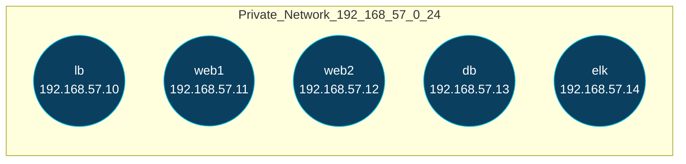

# فاز ۰ — آماده‌سازی محیط Vagrant

## خروجی این فاز

* ایجاد ۵ ماشین: `lb`, `web1`, `web2`, `db`, `elk` روی یک شبکه‌ی خصوصی.
* اطمینان از ارتباط شبکه‌ای (Ping/SSH) بین ماشین‌ها.
* بدون نصب سرویس‌ها (Ansible در فازهای بعد).

## ساختار پوشه‌ها (ایجاد/به‌روزرسانی)

```
elk-lab/
├── Vagrantfile
├── ansible/
│   └── inventories/
│       └── vagrant/
│           ├── hosts.ini
│           └── group_vars/         # (خالی - رزرو برای فازهای بعد)
└── docs/
    └── README.md
```
درست. فاز ۰ را با «Debian Bullseye» و رنج شبکه‌ی `192.168.57.0/24` نهایی می‌کنم. طبق درخواست شما، ابتدا معماری همین فاز و سپس دستور ساخت مسیرها و فایل‌ها، بعد هم تغییرات دقیق فایل‌ها با فرمت خواسته‌شده.

---

## معماری فاز ۰ (شبکه و ماشین‌ها – بدون Provision)



---

## دستور ساخت مسیرها و فایل‌های این فاز (ترمینال)

```bash
# ایجاد دایرکتوری ریشه پروژه
mkdir -p elk-lab

# ایجاد پوشه‌های ansible و inventory
mkdir -p elk-lab/ansible/inventories/vagrant/group_vars
mkdir -p elk-lab/ansible/inventories/vagrant/host_vars

# ایجاد پوشه‌ی مستندات
mkdir -p elk-lab/docs

# ایجاد فایل‌های اصلی (در ادامه محتوا قرار می‌گیرد)
: > elk-lab/Vagrantfile
: > elk-lab/ansible/inventories/vagrant/hosts.ini
: > elk-lab/docs/README.md
```

---

## تغییرات دقیق فایل‌ها

### 1) فایل: `elk-lab/Vagrantfile`

* نوع تغییر: **جایگزینی کامل (Full file)**
* چرا تغییر کرد: جایگزینی سیستم‌عامل پایه به `debian/bullseye64` و تثبیت رنج شبکه‌ی غیرمتداخل `192.168.57.0/24`.
* بخش‌های متاثر: آدرس‌های IP فاز ۰، و سازگاری با رنج جدید در `hosts.ini`.

**محتوای نهایی فایل (کامل):**

```ruby
# encoding: utf-8
# Vagrantfile — ELK Lab (Phase 0) — Debian Bullseye + 192.168.57.0/24
Vagrant.configure("2") do |config|
  # سیستم‌عامل پایه
  config.vm.box = "debian/bullseye64"

  # شبکه‌ی خصوصی ثابت برای همه ماشین‌ها
  NET = "192.168.57"

  # منابع پیش‌فرض کوچک برای محیط آموزشی
  DEFAULT_CPUS = 1
  DEFAULT_RAM  = 1024

  # تابع کمکی برای تعریف نودها
  def define_node(config, name, ip_octet, ram=DEFAULT_RAM, cpus=DEFAULT_CPUS)
    config.vm.define name do |node|
      node.vm.hostname = name
      node.vm.network "private_network", ip: "#{NET}.#{ip_octet}"
      node.vm.provider :virtualbox do |vb|
        vb.name   = "elk-lab-#{name}"
        vb.cpus   = cpus
        vb.memory = ram
      end
      # در صورت نیاز، هم‌مسیر کردن را بعداً فعال می‌کنیم.
      # node.vm.synced_folder ".", "/vagrant", disabled: true
    end
  end

  # نودها و IPها
  define_node(config, "lb",   10, 1024, 1)
  define_node(config, "web1", 11, 1024, 1)
  define_node(config, "web2", 12, 1024, 1)
  define_node(config, "db",   13, 1024, 1)
  define_node(config, "elk",  14, 2048, 2)  # ELK کمی رم بیشتر می‌خواهد

  # نکته: Provision در فازهای بعدی با Ansible انجام خواهد شد.
end
```

### 2) فایل: `elk-lab/ansible/inventories/vagrant/hosts.ini`

* نوع تغییر: **ویرایش جزئی (Partial)**
* چرا تغییر کرد: هم‌راستایی با رنج جدید `192.168.57.0/24`.
* بخش تغییر یافته (آدرس‌ها):

```ini
# encoding: utf-8
[lb]
lb ansible_host=192.168.57.10

[web]
web1 ansible_host=192.168.57.11
web2 ansible_host=192.168.57.12

[db]
db ansible_host=192.168.57.13

[elk]
elk ansible_host=192.168.57.14

[all:vars]
ansible_user=vagrant
ansible_ssh_private_key_file=.vagrant/machines/%h/virtualbox/private_key
```

### 3) فایل: `elk-lab/docs/README.md`

* نوع تغییر: **ویرایش جزئی (Partial)**
* چرا تغییر کرد: به‌روزرسانی رنج شبکه و دستورهای تست برای Debian.

````markdown
# ELK Lab — Phase 0 (Vagrant, Debian Bullseye)
- Provider: VirtualBox
- Network: Private `192.168.57.0/24`
- Nodes: lb, web1, web2, db, elk


### اجرا ماشین ها و تست ماشین ها
## Commands
```bash
vagrant up --no-provision
vagrant status
vagrant ssh lb     # یا هر نود دیگر
vagrant ssh lb -c "cat /etc/os-release"
````

## Quick Connectivity Test

```bash
# داخل lb:
ping -c2 192.168.57.11
ping -c2 192.168.57.12
ping -c2 192.168.57.13
ping -c2 192.168.57.14
```

````

---

## روش اجرای فاز ۰ (با Debian Bullseye)
```bash
cd elk-lab
vagrant up --no-provision
vagrant ssh lb -c "cat /etc/os-release | grep PRETTY_NAME"
vagrant ssh lb -c "ping -c2 192.168.57.11 && ping -c2 192.168.57.12 && ping -c2 192.168.57.13 && ping -c2 192.168.57.14"
````

* اگر خطای Host-Only گرفتی:

```bash
vboxmanage hostonlyif create
vboxmanage list hostonlyifs
# فرض کنیم vboxnet2 ساخته شد:
sudo vboxmanage hostonlyif ipconfig vboxnet2 --ip 192.168.57.1 --netmask 255.255.255.0
vagrant reload --no-provision
```

---

## ملاحظات نقش‌ها

* **DevOps**: رنج مستقل از Wi-Fi و Docker؛ ماشین ELK رم بالاتر.
* **Backend/Software**: هنوز سرویسی نصب نشده؛ صرفاً زیرساخت شبکه آماده است.
* **Database Manager/Data Engineer**: ارتباط پایدار برای فازهای بعد (ارسال لاگ/اتصال DB).
* **Encoding**: تمام فایل‌ها و مستندات با UTF-8.

---

