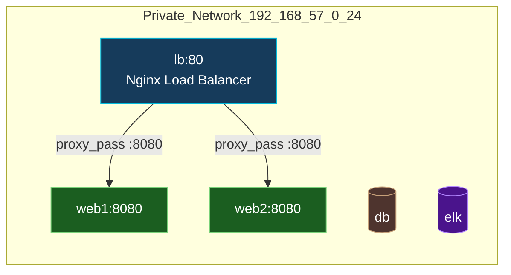

# فاز ۲ — Load Balancer با Nginx

## ۱) معماری این فاز

* توپولوژی شبکه تغییر نمی‌کند (رنج 192.168.57.0/24).
* روی نود `lb` سرویس **Nginx** به‌عنوان لودبالنسر HTTP روی پورت **80** فعال می‌شود.
* مقصد ترافیک، نودهای `web1` و `web2` روی پورت **8080** هستند (در **فاز ۳** بالا می‌آیند).
* برای جلوگیری از خطا تا قبل از فاز ۳:

  * مسیری مثل `/healthz` روی خود LB پاسخ 200 می‌دهد.
  * upstream تعریف می‌شود، ولی اگر backendها آماده نباشند، صفحهٔ خطای سفارشی 502/504 باز می‌گردد (سازگار با ELK).



---

## ۲) دستور ساخت مسیرها و فایل‌ها (ترمینال)

ابتدای هر فاز طبق درخواست شما، اول **ساخت مسیرها و فایل‌های لازم**:

```bash
# فرض: در ریشه پروژه هستید: elk-lab/

# 1) نقش Ansible برای لودبالنسر
mkdir -p ansible/roles/loadbalancer/{tasks,handlers,templates,defaults,vars,files}

# 2) فایل‌های نقش
: > ansible/roles/loadbalancer/tasks/main.yml
: > ansible/roles/loadbalancer/handlers/main.yml
: > ansible/roles/loadbalancer/defaults/main.yml
: > ansible/roles/loadbalancer/vars/main.yml
: > ansible/roles/loadbalancer/templates/nginx.conf.j2
: > ansible/roles/loadbalancer/templates/lb.conf.j2
: > ansible/roles/loadbalancer/templates/error_page.html.j2

# 3) playbook مخصوص فاز ۲
mkdir -p ansible/playbooks
: > ansible/playbooks/loadbalancer.yml

# 4) متغیرهای گروهی برای LB
mkdir -p ansible/inventories/vagrant/group_vars
: > ansible/inventories/vagrant/group_vars/loadbalancers.yml

# 5) (اختیاری) قالب لاگ‌خوان ELK در آینده (فقط محل نگهداری صفحات خطا)
# از الان یک صفحه خطای سفارشی که UTF-8 باشد
```

---

## ۳) ساختار فایل/مسیر (TREE) و نقش هر فایل

```
ansible/
├─ inventories/
│  └─ vagrant/
│     ├─ hosts.ini                # قبلاً اصلاح شد (گروه‌ها: loadbalancers, webservers, ...)
│     └─ group_vars/
│        └─ loadbalancers.yml     # پارامترهای LB (الگوریتم، سرورها، پورت‌ها، تایم‌اوت‌ها)
├─ playbooks/
│  └─ loadbalancer.yml            # اجرای نقش loadbalancer روی گروه loadbalancers
└─ roles/
   └─ loadbalancer/
      ├─ defaults/
      │  └─ main.yml              # مقادیر پیش‌فرض نقش (ایمن و مینیمال)
      ├─ vars/
      │  └─ main.yml              # (فعلاً خالی؛ اگر مقدار ثابت خاصی لازم شد)
      ├─ tasks/
      │  └─ main.yml              # نصب Nginx + دیپلوی کانفیگ‌ها + enable/start
      ├─ handlers/
      │  └─ main.yml              # Reload/Restart Nginx
      ├─ templates/
      │  ├─ nginx.conf.j2         # کانفیگ اصلی Nginx (log_format JSON برای ELK)
      │  ├─ lb.conf.j2            # upstream + سرور بلاک (پورت 80، healthz، proxy_pass)
      │  └─ error_page.html.j2    # صفحه خطای UTF-8 برای 502/504
      └─ files/                   # (در صورت نیاز به فایل‌های استاتیک)
```

### نقش هر فایل (خلاصه)

* `loadbalancer.yml`: ران‌کردن role روی گروه `loadbalancers` با `become: yes`.
* `defaults/main.yml`: پارامترهای قابل override (پورت listen، الگوریتم، سرورها، تایم‌اوت‌ها).
* `group_vars/loadbalancers.yml`: مقداردهی پروژه‌ای (مثل IPهای web1/web2).
* `templates/nginx.conf.j2`: حداقل کانفیگ اصلی + فرمت لاگ JSON سازگار با ELK.
* `templates/lb.conf.j2`: تعریف `upstream app_upstream { ... }` و `server { listen 80; ... }`.
* `templates/error_page.html.j2`: صفحه خطا (UTF-8، بدون اطلاعات حساس).
* `tasks/main.yml`: نصب Nginx، کپی قالب‌ها، فعال‌سازی سرویس.
* `handlers/main.yml`: reload ایمن پس از تغییر کانفیگ‌ها.

---

## ۴) محتوا/سیاست فایل‌ها (تعاریف—در این مرحله فقط تعریف، اجرا بعد از تأیید)

### ۴.۱) `ansible/playbooks/loadbalancer.yml`

* نوع: **ایجاد کامل**
* نقش: اجرای role روی گروه `loadbalancers`

```yaml
# encoding: utf-8
---
- name: Configure Nginx Load Balancer
  hosts: loadbalancers
  become: yes
  roles:
    - loadbalancer
```

### ۴.۲) `ansible/inventories/vagrant/group_vars/loadbalancers.yml`

* نوع: **ایجاد کامل**
* چرا: قابلیت تغییر الگوریتم و سرورها بدون تغییر قالب‌ها

```yaml
# encoding: utf-8
---
lb_listen_port: 80
upstream_port: 8080
lb_method: "round_robin"    # مقادیر: round_robin | ip_hash | least_conn

upstream_servers:
  - { name: "web1", host: "192.168.57.11" }
  - { name: "web2", host: "192.168.57.12" }

proxy_connect_timeout: 2s
proxy_read_timeout: 5s
proxy_send_timeout: 5s
proxy_next_upstream: "error timeout http_502 http_503 http_504"
```

### ۴.۳) `ansible/roles/loadbalancer/defaults/main.yml`

* نوع: **ایجاد کامل**

```yaml
# encoding: utf-8
---
lb_listen_port: 80
upstream_port: 8080
lb_method: "round_robin"
upstream_servers: []
proxy_connect_timeout: 2s
proxy_read_timeout: 5s
proxy_send_timeout: 5s
proxy_next_upstream: "error timeout http_502 http_503 http_504"
```

### ۴.۴) `ansible/roles/loadbalancer/templates/nginx.conf.j2`

* نوع: **ایجاد کامل**
* نکات: `log_format` ساخت‌یافته برای ELK (UTF-8-safe)

```jinja
# encoding: utf-8
user www-data;
worker_processes auto;
pid /run/nginx.pid;

events { worker_connections 1024; }

http {
    include       /etc/nginx/mime.types;
    default_type  application/octet-stream;

    sendfile on; tcp_nopush on; tcp_nodelay on;
    types_hash_max_size 2048;

    log_format json_combined escape=json
      '{ "time":"$time_iso8601", "remote_addr":"$remote_addr", '
      '"method":"$request_method", "uri":"$request_uri", "status":$status, '
      '"bytes_sent":$bytes_sent, "referer":"$http_referer", "ua":"$http_user_agent", '
      '"request_time":$request_time, "upstream":"$upstream_addr", "upstream_time":"$upstream_response_time" }';

    access_log /var/log/nginx/access.log json_combined;
    error_log  /var/log/nginx/error.log warn;

    # کانفیگ لودبالنسر
    include /etc/nginx/conf.d/*.conf;
}
```

### ۴.5) `ansible/roles/loadbalancer/templates/lb.conf.j2`

* نوع: **ایجاد کامل**
* نکات: کنترل الگوریتم بالانس با `lb_method`، healthz محلی، error\_page UTF-8

```jinja
# encoding: utf-8

upstream app_upstream {
    ip_hash;

upstream app_upstream {
    least_conn;

upstream app_upstream {
    # round_robin (default)


    server {{ s.host }}:{{ upstream_port }} max_fails=2 fail_timeout=3s;

}

server {
    listen {{ lb_listen_port }};
    server_name _;

    # health endpoint مستقل از upstream
    location /healthz {
        default_type text/plain;
        return 200 "ok\n";
        add_header Cache-Control "no-store";
    }


    # صفحهٔ خطای UTF-8
    error_page 502 503 504 /custom_50x.html;
    location = /custom_50x.html {
        root /usr/share/nginx/html;
        internal;
    }

    location / {
        proxy_set_header Host              $host;
        proxy_set_header X-Real-IP         $remote_addr;
        proxy_set_header X-Forwarded-For   $proxy_add_x_forwarded_for;
        proxy_set_header X-Forwarded-Proto $scheme;

        proxy_connect_timeout {{ proxy_connect_timeout }};
        proxy_read_timeout    {{ proxy_read_timeout }};
        proxy_send_timeout    {{ proxy_send_timeout }};
        proxy_next_upstream   {{ proxy_next_upstream }};

        proxy_pass http://app_upstream;
    }
}

```

### ۴.۶) `ansible/roles/loadbalancer/templates/error_page.html.j2`

* نوع: **ایجاد کامل**
* نکته: صفحهٔ UTF-8 بدون نشت اطلاعات

```html
<!-- encoding: utf-8 -->
<!doctype html>
<html lang="fa" dir="rtl">
<head>
  <meta charset="utf-8"/>
  <title>خطای موقت</title>
  <meta name="viewport" content="width=device-width, initial-scale=1"/>
  <style>
    body { font-family: sans-serif; margin: 2rem; }
    .box { border: 1px solid #ccc; padding: 1rem; border-radius: .5rem; }
  </style>
</head>
<body>
  <div class="box">
    <h1>خطا</h1>
    <p>خدمت موقتاً در دسترس نیست. لطفاً چند لحظه بعد دوباره تلاش کنید.</p>
  </div>
</body>
</html>
```

### ۴.۷) `ansible/roles/loadbalancer/tasks/main.yml`

* نوع: **ایجاد کامل**

```yaml
# encoding: utf-8
---
- name: Install Nginx (Debian)
  apt:
    name: nginx
    state: present
    update_cache: yes

- name: Ensure /etc/nginx/conf.d exists
  file:
    path: /etc/nginx/conf.d
    state: directory
    owner: root
    group: root
    mode: "0755"

- name: Deploy main nginx.conf
  template:
    src: nginx.conf.j2
    dest: /etc/nginx/nginx.conf
    owner: root
    group: root
    mode: "0644"
  notify: Reload nginx

- name: Deploy LB config (upstream + server)
  template:
    src: lb.conf.j2
    dest: /etc/nginx/conf.d/lb.conf
    owner: root
    group: root
    mode: "0644"
  notify: Reload nginx

- name: Deploy custom error page (UTF-8)
  template:
    src: error_page.html.j2
    dest: /usr/share/nginx/html/custom_50x.html
    owner: root
    group: root
    mode: "0644"

- name: Validate nginx configuration (nginx -t)
  command: nginx -t
  register: nginx_test
  changed_when: false
  failed_when: nginx_test.rc != 0

- name: Ensure nginx enabled and running
  service:
    name: nginx
    state: started
    enabled: yes

```

### ۴.۸) `ansible/roles/loadbalancer/handlers/main.yml`

* نوع: **ایجاد کامل**

```yaml
# encoding: utf-8
---
- name: Reload nginx
  service:
    name: nginx
    state: reloaded
```

### ۴.۹) `ansible/roles/loadbalancer/vars/main.yml`

* نوع: **ایجاد کامل (فعلاً خالی)**

```yaml
# encoding: utf-8
---
# Reserved for fixed values if needed later
```

---

## 5) ملاحظات چندنقشی (یکپارچگی)

* **DevOps:**

  * کانفیگ ماژولار با `group_vars` و `defaults`؛ idempotent.
  * JSON access log برای ingestion در ELK (فازهای بعدی).
  * healthz مستقل از upstream تا پایش زودهنگام ممکن شود.
* **Backend Developer:**

  * هدرهای `X-Forwarded-*` تنظیم شده؛ آماده لاگ‌گیری end-to-end.
  * در فاز ۳، اپ روی 8080 کافی است تا LB آمادهٔ روتینگ شود.
* **Software Engineer (SOLID/Modularity):**

  * جداسازی templateها و پارامترها؛ انتخاب الگوریتم بالانس با یک متغیر.
  * تست‌پذیری بالا (nginx -t، healthz، لاگ ساخت‌یافته).
* **Database Manager:**

  * تغییری در این فاز ندارد؛ اما مسیر ترافیکی وب بعداً به DB می‌رسد.
  * زمان‌بندی و فرمت لاگ‌ها ثابت (UTC و UTF-8) برای تحلیل‌های بعدی.
* **Data Engineer:**

  * فرمت JSON در `access.log` برای پارس آسان‌تر در Logstash/Elasticsearch.
  * کدگذاری UTF-8 برای نمایش صحیح متون فارسی.
* **Encoding/UTF-8:**

  * همهٔ templateها و صفحات خطا با `utf-8`؛ سازگار با نمایش فارسی.

---

## 6) ریسک‌ها و Edge Caseها

* اگر پورت 80 توسط سرویس دیگری اشغال باشد، سرویس Nginx بالا نمی‌آید → تست `nginx -t` و بررسی `systemctl status`.
* اگر `web1/web2` در فاز ۳ روی 8080 بالا نیایند، LB 502 باز می‌گرداند (قابل‌قبول در این فاز).
* در صورت نیاز به SSL/TLS در فازهای بعد، ساختار فعلی به‌راحتی با `server { listen 443 ssl; }` و certها توسعه می‌یابد.1) پیش‌نیازهای اجرا (Sanity Check)
* و در انتهای فایل `hosts.ini` متغیرهای سراسری:

  ```
  ansible_python_interpreter=/usr/bin/python3
  ```

3. اگر قبلاً `ansible.cfg` در ریشهٔ پروژه گذاشته‌ای:

   * مطمئن شو `roles_path = ansible/roles` تنظیم باشد.

---

# اجرای پلی‌بوک فاز ۲


## 1) (Load Balancer)

از ریشهٔ پروژه (همان جایی که `ansible/` است):

```bash
ansible-playbook -i ansible/inventories/vagrant/hosts.ini ansible/playbooks/loadbalancer.yml
```

گزینه‌های مفید:

* اجرای محدود فقط روی گروه LB:

```bash
ansible-playbook -i ansible/inventories/vagrant/hosts.ini ansible/playbooks/loadbalancer.yml --limit loadbalancers
```

* Dry-run برای مشاهده تغییرات بدون اعمال:

```bash
ansible-playbook -i ansible/inventories/vagrant/hosts.ini ansible/playbooks/loadbalancer.yml --check
```

* خروجی جزئیات بیشتر برای عیب‌یابی:

```bash
ansible-playbook -i ansible/inventories/vagrant/hosts.ini ansible/playbooks/loadbalancer.yml -vvv
```

---

## 2) راستی‌آزمایی در نود lb

1. صحت کانفیگ Nginx:

```bash
vagrant ssh lb -c "sudo nginx -t"
```

انتظار: `syntax is ok` و `test is successful`.

2. وضعیت سرویس:

```bash
vagrant ssh lb -c "systemctl is-active nginx && systemctl is-enabled nginx"
```

انتظار: `active` و سپس `enabled`.

3. تست Health داخلی:

```bash
curl -i http://192.168.57.10/healthz
```

انتظار: `HTTP/1.1 200 OK` و متن `ok`.

4. بررسی لاگ‌ها (برای آماده‌سازی ELK):

```bash
vagrant ssh lb -c "sudo tail -n 20 /var/log/nginx/access.log"
vagrant ssh lb -c "sudo tail -n 50 /var/log/nginx/error.log"
```

Access باید با فرمت JSON باشد (طبق `json_combined`).

5. بررسی استقرار فایل‌ها:

```bash
vagrant ssh lb -c "ls -l /etc/nginx/nginx.conf /etc/nginx/conf.d/lb.conf /usr/share/nginx/html/custom_50x.html"
```

6. تست مسیر روت (چون webها هنوز سرویس روی 8080 ندارند):

```bash
curl -i http://192.168.57.10/
```

انتظار: در این فاز احتمالاً وضعیت 502/504 با صفحهٔ خطای سفارشی UTF-8 (`custom_50x.html`)—این طبیعی است تا فاز ۳ را اجرا کنیم.

---

## 4) پارامترها و تغییرات سریع بدون دستکاری قالب‌ها

فایل: `ansible/inventories/vagrant/group_vars/loadbalancers.yml`

* تغییر الگوریتم بالانس:

  * `lb_method: "round_robin"` یا `"ip_hash"` یا `"least_conn"`
* تغییر لیست سرورها:

  ```yaml
  upstream_servers:
    - { name: "web1", host: "192.168.57.11" }
    - { name: "web2", host: "192.168.57.12" }
  ```
* تغییر پورت‌ها و تایم‌اوت‌ها:

  ```yaml
  lb_listen_port: 80
  upstream_port: 8080
  proxy_connect_timeout: 2s
  proxy_read_timeout: 5s
  proxy_send_timeout: 5s
  ```

پس از هر تغییر در group\_vars، دوباره همان پلی‌بوک را اجرا کن تا `notify: Reload nginx` اعمال شود.

---

## 5) سناریوهای خطای رایج و رفع آن‌ها

* خطا: `Failed to connect to the host via ssh`
  علت: مسیر کلید اشتباه یا گروه/هاست اشتباه در `hosts.ini`.
  رفع: از `vagrant ssh-config` مسیر دقیق کلید هر ماشین را بگیر و در `hosts.ini` ست کن.
* خطا: `nginx: [emerg]` در `nginx -t`
  علت: سینتکس اشتباه در قالب‌ها یا پورت مشغول.
  رفع: خروجی `nginx -t` را بخوان، اگر `listen 80` اشغال است، ببین سرویس دیگری روی 80 نیست. اگر هست، آن را stop/disable کن یا پورت دیگری انتخاب کن.
* خطا: باز نشدن پورت 80 از میزبان
  علت: فایروال میزبان یا مهمان. در فاز ۱ ما `ufw` را مدیریت نکردیم.
  رفع: روی نود `lb`:

  ```bash
  vagrant ssh lb -c "sudo ss -ltnp | grep ':80 '"
  ```

  اگر Nginx گوش می‌دهد ولی از میزبان باز نمی‌شود، فایروال میزبان را بررسی کن.
* 502/504 روی مسیر `/`
  طبیعی است تا وقتی فاز ۳ را اجرا نکرده‌ای (وب‌سرورها روی پورت 8080 بالا نیستند). مسیر `/healthz` باید 200 بدهد.

---

## 6) آزمون idempotency

برای اطمینان از idempotent بودن نقش:

```bash
ansible-playbook -i ansible/inventories/vagrant/hosts.ini ansible/playbooks/loadbalancer.yml
ansible-playbook -i ansible/inventories/vagrant/hosts.ini ansible/playbooks/loadbalancer.yml
```

اجرای دوم باید عمدتاً `ok` نشان دهد و `changed` حداقلی باشد (مگر variableها را تغییر داده باشی).

---

## 7) بازگشت (Rollback) سریع

اگر لازم شد تغییرات Nginx را موقتاً غیرفعال کنی:

```bash
vagrant ssh lb -c "sudo systemctl stop nginx && sudo systemctl disable nginx"
```

یا حذف role را با task اختصاصی در آینده انجام می‌دهیم (فعلاً نیاز نیست).
