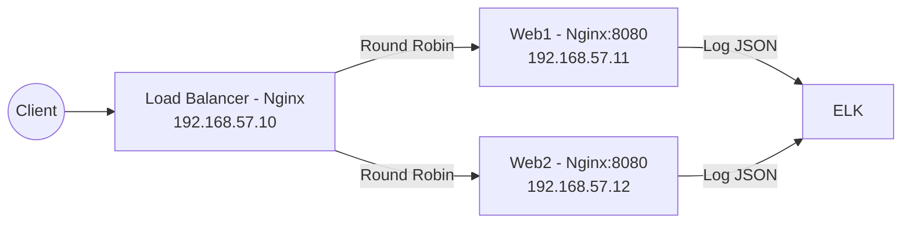

# فاز ۳ – وب‌سرورها (web1, web2)

## ۱. هدف

* آماده‌سازی دو وب‌سرور (`web1`, `web2`) روی پورت **8080** برای پاسخ‌دهی ساده (Hello / Healthz).
* هماهنگی کامل با LB (فاز ۲) تا درخواست‌ها بین این دو نود تقسیم شوند.
* ثبت لاگ‌ها به فرمت JSON برای ingestion آینده در ELK.
* همه چیز ماژولار و idempotent با Ansible.

---

## ۲. معماری این فاز



---

## ۳. مسیرها و فایل‌ها

```
elk-lab/
├── ansible/
│   ├── inventories/
│   │   └── vagrant/
│   │       ├── hosts.ini
│   │       └── group_vars/
│   │           └── webservers.yml
│   ├── playbooks/
│   │   └── webservers.yml
│   └── roles/
│       └── webserver/
│           ├── defaults/
│           │   └── main.yml
│           ├── tasks/
│           │   └── main.yml
│           ├── handlers/
│           │   └── main.yml
│           └── templates/
│               ├── nginx.conf.j2
│               ├── site.conf.j2
│               └── index.html.j2
```

---

## ۴. نقش هر فایل

* **`group_vars/webservers.yml`**: پورت، مسیر وب‌ریشه، الگوریتم لاگ.
* **`playbooks/webservers.yml`**: Playbook برای اجرای نقش روی گروه `[webservers]`.
* **`roles/webserver/defaults/main.yml`**: مقادیر پیش‌فرض (پورت=8080، مسیر=/var/www/app).
* **`roles/webserver/tasks/main.yml`**: نصب nginx، کپی قالب‌ها، فعال‌سازی سرویس.
* **`roles/webserver/handlers/main.yml`**: ریستارت/ریلود nginx.
* **`roles/webserver/templates/nginx.conf.j2`**: پیکربندی کلی Nginx با فرمت لاگ JSON.
* **`roles/webserver/templates/site.conf.j2`**: VirtualHost روی پورت 8080 (index + healthz).
* **`roles/webserver/templates/index.html.j2`**: صفحه ساده (Hello از webX).

---

## ۵. دستور ساخت مسیرها و فایل‌ها

از ریشه پروژه اجرا کن:

```bash
mkdir -p ansible/inventories/vagrant/group_vars
mkdir -p ansible/playbooks
mkdir -p ansible/roles/webserver/{defaults,tasks,handlers,templates}

touch ansible/inventories/vagrant/group_vars/webservers.yml
touch ansible/playbooks/webservers.yml
touch ansible/roles/webserver/defaults/main.yml
touch ansible/roles/webserver/tasks/main.yml
touch ansible/roles/webserver/handlers/main.yml
touch ansible/roles/webserver/templates/nginx.conf.j2
touch ansible/roles/webserver/templates/site.conf.j2
touch ansible/roles/webserver/templates/index.html.j2
```

---

## ۶. تست این فاز (پس از تکمیل محتوا)

1. روی هر وب‌سرور:

   ```bash
   curl -i http://192.168.57.11:8080/healthz
   curl -i http://192.168.57.12:8080/healthz
   ```

   → انتظار: 200 OK و متن `ok`.

2. از LB:

   ```bash
   curl -i http://192.168.57.10/
   ```

   → انتظار: پاسخ یکی از وب‌سرورها (`Hello from web1` / `Hello from web2`).

3. بررسی لاگ روی web1/web2:

   ```bash
   sudo tail -n 5 /var/log/nginx/access.log
   ```

   → انتظار: رکورد JSON.

---

خوب، سجاد.
همه محتوا را بر اساس فازهای قبلی (فاز ۱: common و فاز ۲: loadbalancer) با همان الگو و یکپارچگی آماده کردم. در این فاز وب‌سرورها مستقل روی 8080 کار می‌کنند و LB به آن‌ها وصل خواهد شد.

---

# فاز ۳ – محتوای فایل‌ها

## ۱. `ansible/inventories/vagrant/group_vars/webservers.yml`

```yaml
# تنظیمات وب‌سرورها (web1, web2)
webserver_port: 8080
webserver_root: /var/www/app
webserver_server_name: "_"

# لاگ JSON سازگار با ELK
webserver_log_format: |
  log_format json_combined escape=json
    '{ "time":"$time_iso8601",'
    ' "remote_addr":"$remote_addr",'
    ' "method":"$request_method",'
    ' "uri":"$uri",'
    ' "status":$status,'
    ' "bytes_sent":$bytes_sent,'
    ' "request_time":$request_time }';
```

---

## 2. `ansible/playbooks/webservers.yml`

```yaml
# encoding: utf-8
---
- name: Configure Web Servers
  hosts: webservers
  become: yes
  roles:
    - webserver
```

---

## 3. `ansible/roles/webserver/defaults/main.yml`

```yaml
# مقادیر پیش‌فرض
webserver_port: 8080
webserver_root: /var/www/app
webserver_server_name: "_"
```

---

## 4. `ansible/roles/webserver/tasks/main.yml`

```yaml
# encoding: utf-8
---
- name: Install Nginx
  apt:
    name: nginx
    state: present
    update_cache: yes

- name: Ensure web root exists
  file:
    path: "{{ webserver_root }}"
    state: directory
    owner: www-data
    group: www-data
    mode: '0755'

- name: Deploy index.html
  template:
    src: index.html.j2
    dest: "{{ webserver_root }}/index.html"
    owner: www-data
    group: www-data
    mode: '0644'
  notify: Reload nginx

- name: Deploy nginx.conf
  template:
    src: nginx.conf.j2
    dest: /etc/nginx/nginx.conf
    owner: root
    group: root
    mode: '0644'
  notify: Reload nginx

- name: Deploy site config
  template:
    src: site.conf.j2
    dest: /etc/nginx/conf.d/site.conf
    owner: root
    group: root
    mode: '0644'
  notify: Reload nginx

- name: Validate nginx configuration
  command: nginx -t
  register: nginx_check
  changed_when: false
  failed_when: nginx_check.rc != 0

- name: Ensure nginx is enabled and running
  service:
    name: nginx
    state: started
    enabled: yes
```

---

## 5. `ansible/roles/webserver/handlers/main.yml`

```yaml
# encoding: utf-8
---
- name: Reload nginx
  service:
    name: nginx
    state: reloaded
```

---

## 6. `ansible/roles/webserver/templates/nginx.conf.j2`

```nginx
user www-data;
worker_processes auto;
pid /run/nginx.pid;

events {
    worker_connections 1024;
}

http {
    include       /etc/nginx/mime.types;
    default_type  application/octet-stream;

    {{ webserver_log_format }}

    access_log /var/log/nginx/access.log json_combined;
    error_log  /var/log/nginx/error.log warn;

    sendfile on;
    keepalive_timeout 65;

    include /etc/nginx/conf.d/*.conf;
}
```

---

## 7. `ansible/roles/webserver/templates/site.conf.j2`

```nginx
server {
    listen {{ webserver_port }};
    server_name {{ webserver_server_name }};

    root {{ webserver_root }};
    index index.html;

    location / {
        try_files $uri $uri/ =404;
    }

    location /healthz {
        default_type text/plain;
        return 200 'ok\n';
    }
}
```

---

## 8. `ansible/roles/webserver/templates/index.html.j2`

```html
<!DOCTYPE html>
<html lang="en">
<head>
    <meta charset="UTF-8">
    <title>Hello Web</title>
</head>
<body>
    <h1>Hello from {{ inventory_hostname }}</h1>
    <p>Served by Ansible-managed Nginx on port {{ webserver_port }}</p>
</body>
</html>
```

---

# تست بعد از اجرا

1. اجرا:

```bash
ansible-playbook -i ansible/inventories/vagrant/hosts.ini ansible/playbooks/webservers.yml
```

2. بررسی مستقیم وب‌سرورها:

```bash
curl -i http://192.168.57.11:8080/healthz
curl -i http://192.168.57.12:8080/healthz
```

3. تست LB (192.168.57.10):

```bash
curl -i http://192.168.57.10/
```

→ باید یک بار پیام web1 و یک بار پیام web2 ببینی.

---

## تست‌های نهایی فاز ۳

### 1) اطمینان از Round-Robin روی LB

```bash
vagrant ssh lb
# 6 بار درخواست بده و تیتر H1 را ببین
for i in {1..6}; do curl -s http://192.168.57.10/ | grep '<h1>'; done
```

انتظار: بین `Hello from web1` و (در دفعاتی) `Hello from web2` جابجا شود. اگر همه پاسخ‌ها از web1 بود، دوباره اجرا کن (کش/keepalive یا زمان‌بندی می‌تواند اثر بگذارد).


output:
```
      <h1>Hello from web2</h1>
      <h1>Hello from web1</h1>
      <h1>Hello from web2</h1>
      <h1>Hello from web1</h1>
      <h1>Hello from web2</h1>
      <h1>Hello from web1</h1>
```
### 2) مشاهده لاگ‌ها برای تطبیق

روی LB:

```bash
vagrant ssh lb -c "sudo tail -n 20 /var/log/nginx/access.log"
```

باید رکوردهای JSON با کلیدهایی مثل `"upstream"` و `"upstream_time"` ببینی؛ این نشان می‌دهد به کدام وب‌سرور روت شده.
روی web1 و web2 هم لاگ محلی را ببین:

```bash
vagrant ssh web1 -c "sudo tail -n 10 /var/log/nginx/access.log"
vagrant ssh web2 -c "sudo tail -n 10 /var/log/nginx/access.log"
```

### 3) تست تحمل خطا (اختیاری)

«بدون تغییر در فایل‌ها»، فقط برای مشاهده رفتار LB:

```bash
# موقتاً web1 را خاموش کن
vagrant ssh web1 -c "sudo systemctl stop nginx"

# تست از LB
for i in {1..4}; do curl -s -o /dev/null -w "%{http_code}\n" http://192.168.57.10/; done

# انتظار: هنوز باید 200 از web2 بگیری. سپس web1 را برگردان:
vagrant ssh web1 -c "sudo systemctl start nginx"
```

### 4) سنجش سلامت نهایی

```bash
curl -i http://192.168.57.10/healthz
curl -i http://192.168.57.11:8080/healthz
curl -i http://192.168.57.12:8080/healthz
```

---

## جمع‌بندی فاز ۳ (۵ نقش)

* **DevOps:** نقش webserver مستقل، `nginx -t` قبل از reload، healthz روی هر وب‌سرور، لاگ JSON؛ Playbookها idempotent.
* **Backend Developer:** مسیر `/` سرو می‌شود؛ `/healthz` برای probe؛ سازگار با `X-Forwarded-*` از LB.
* **Software Engineer (SOLID/Modularity):** پارامترها در `group_vars/webservers.yml`، قالب‌ها جدا، تست‌پذیری بالا.
* **Data Engineer:** فرمت JSON در لاگ‌های LB و وب‌سرورها برای ingestion در ELK (فازهای بعد).
* **Database Manager:** تغییری در DB ندارد؛ مسیر ترافیکی وب برای اپ‌های بعدی پایدار و قابل‌گسترش است.
* **Encoding:** تمامی قالب‌ها UTF-8؛ پاسخ‌های فارسی/انگلیسی بدون مشکل.

---

