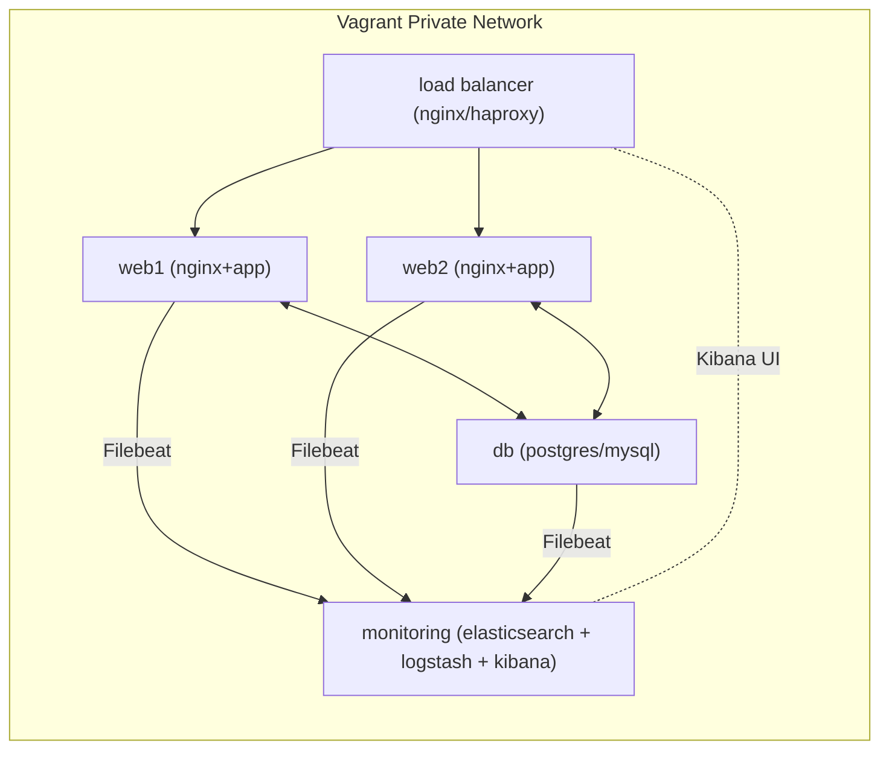
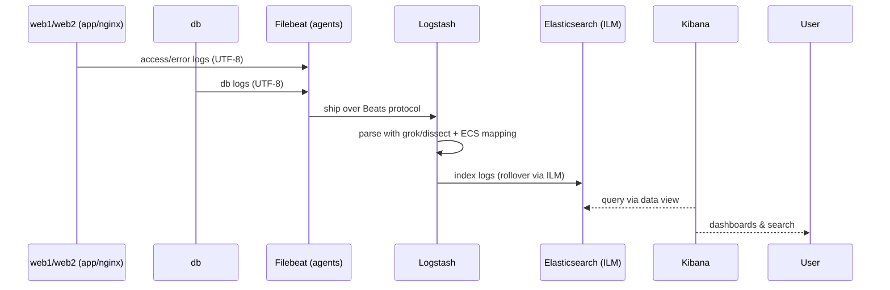

<div dir='rtl'>


# پروژه آموزشی ELK با Ansible و Vagrant

> نقش‌ها: Database Manager | DevOps Engineer | Software Engineer | Backend Developer | Data Engineer
> رمزگذاری متن‌ها و لاگ‌ها: UTF-8

---

## 1) تعریف دقیق پروژه

### شرح

یک محیط چندماشینه‌ی ایزوله برای یادگیری و تمرین ELK (Elasticsearch، Logstash، Kibana) می‌سازیم که شبیه‌ساز یک سیستم واقعی وب است: یک Load Balancer، دو وب‌سرور، یک پایگاه‌داده، و یک نود مانیتورینگ (ELK). لاگ‌های سرویس‌ها به‌صورت ساخت‌یافته جمع‌آوری، پردازش، ایندکس و در Kibana مشاهده می‌شوند. استقرار ماشین‌ها با **Vagrant** و پیکربندی آن‌ها با **Ansible (role-based)** انجام می‌شود.

### اهداف

* تولید لاگ‌های نمونه (Nginx/اپلیکیشن) روی `web1` و `web2` و رویدادهای DB روی `db`.
* جمع‌آوری لاگ‌ها با **Filebeat** روی هر نود و ارسال به **Logstash** برای پردازش (grok/dissect) و نگاشت به **ECS**. ([Elastic][1])
* ایندکس‌گذاری در **Elasticsearch** با **ILM** برای داده‌های زمانی و مشاهده در **Kibana** (Data Views). ([Elastic][2])
* مدیریت زیرساخت با **Ansible roles** و ایجاد محیط چندماشینه با **Vagrant** (شبکه خصوصی). ([Ansible Docs][3], [HashiCorp Developer][4])

### کارکردها (Functional)

* جمع‌آوری و ارسال لاگ‌ها (Filebeat → Logstash → Elasticsearch).
* ایجاد mapping مبتنی بر **Elastic Common Schema (ECS)** برای همسان‌سازی فیلدها. ([Elastic][5])
* مصورسازی در Kibana و ساخت Data View برای ایندکس‌های لاگ. ([Elastic][6])
* مدیریت چرخه عمر ایندکس‌ها با **ILM** (rollover/retention). ([Elastic][2])

### نیازمندی‌ها (Non-Functional)

* ماژولار، قابل توسعه (role-based)، تکرارپذیر و idempotent.
* تحمل حداقلی خطا و جداسازی سرویس‌ها در شبکه خصوصی Vagrant. ([HashiCorp Developer][7])
* نمایش صحیح داده‌های فارسی در تمام مسیرها با UTF-8.

---

## 2) معماری پیشنهادی

### دیاگرام معماری (هم‌راستا با تصویر ارسالی)



* شبکه: **Private Network** بین ماشین‌ها (دسترسی فقط از میزبان). ([HashiCorp Developer][7])
* جمع‌آوری لاگ: **Filebeat** روی `web1`,`web2`,`db`؛ ارسال به **Logstash**. ([Elastic][1])
* پردازش: **Logstash** (grok/dissect)، نگاشت به **ECS**. ([Elastic][8])
* ذخیره‌سازی: **Elasticsearch** با **ILM** (hot→warm→delete). ([Elastic][2])
* مشاهده: **Kibana** (Data Views، Discover/Dashboards). ([Elastic][6])

### جریان داده



### تحلیل گزینه‌ها و تصمیم‌ها

| موضوع               | گزینه‌ها                     | مزایا                                     | معایب                                 | تصمیم                                                                  |
| ------------------- | ---------------------------- | ----------------------------------------- | ------------------------------------- | ---------------------------------------------------------------------- |
| جمع‌آوری لاگ        | Filebeat vs Fluent Bit       | Filebeat: ادغام بومی با Elastic، ماژول‌ها | حجم باینری بزرگ‌تر نسبت به Fluent Bit | **Filebeat** برای همخوانی با مستندات Elastic انتخاب شد. ([Elastic][1]) |
| پردازش              | Logstash vs Ingest Pipeline  | Logstash: انعطاف، پلاگین grok/dissect     | مصرف منابع بیشتر                      | برای آموزش **Logstash** انتخاب شد. ([Elastic][8])                      |
| اسکیمای داده        | ECS vs سفارشی                | سازگاری سراسری، تحلیل ساده‌تر             | نیاز به انطباق فیلدها                 | **ECS** معیار اصلی فیلدها. ([Elastic][9])                              |
| مدیریت عمر ایندکس   | ILM vs Cron delete           | خودکار، امن، استاندارد                    | نیازمند پیکربندی                      | **ILM** فعال می‌شود. ([Elastic][2])                                    |
| سازماندهی اتوماسیون | Ansible roles vs تک Playbook | ماژولار، تست‌پذیر                         | پیچیدگی اولیه                         | **Role-based** طبق داک رسمی. ([Ansible Docs][3])                       |
| توپولوژی            | تک‌ماشین vs چندماشین         | نزدیکی به واقعیت، ایزولاسیون              | منابع بیشتر                           | **چندماشین Vagrant** مطابق داک. ([HashiCorp Developer][4])             |

### الزامات کیفیت/عملیاتی

* Heap Elasticsearch متناسب RAM (مثلاً 1–2GB برای محیط آموزشی)، محدودیت فایل‌ها و watermark دیسک را پایش کنید (Best Practice Elastic).
* زمان‌بندی/همگام‌سازی زمان (NTP) برای ترتیب صحیح eventها.
* همه‌ی localeها و فایل‌ها **UTF-8**؛ در Ansible با `LANG=C.UTF-8`/`en_US.UTF-8` یا تنظیم معادل.

---

## 3) فازبندی پروژه

> در این مرحله فقط تعریف کلی ارائه می‌شود؛ اجرا در بخش بعدی و پس از تایید شما آغاز می‌گردد.

### ساختار پوشه‌ها (نمای کلی)

```
elk-lab/
├── Vagrantfile
├── ansible/
│   ├── inventories/
│   │   └── vagrant/
│   │       ├── hosts.ini
│   │       ├── group_vars/
│   │       │   ├── all.yml
│   │       │   ├── web.yml
│   │       │   ├── db.yml
│   │       │   └── elk.yml
│   │       └── host_vars/
│   ├── playbooks/
│   │   ├── site.yml
│   │   ├── web.yml
│   │   ├── db.yml
│   │   └── elk.yml
│   └── roles/
│       ├── common/           # تنظیمات پایه (users, packages, locale UTF-8, ntp)
│       ├── loadbalancer/     # nginx/haproxy
│       ├── web/              # nginx + نمونه اپ و لاگ ساخت‌یافته JSON
│       ├── db/               # postgres/mysql + log config
│       ├── filebeat/         # agent روی web و db (ارسال به Logstash)
│       ├── logstash/         # pipelines, filters (grok/dissect), ecs mapping
│       ├── elasticsearch/    # single-node + ILM + templates
│       └── kibana/           # data view, saved objects (optional API)
└── docs/
    └── README.md
```

> نقش Ansible roles و سازمان‌دهی طبق داک رسمی **Roles** و **Best Practices** انجام می‌شود. ([Ansible Docs][3])

### جدول فازها

| فاز                       | هدف                   | فایل‌ها/مسیرها که تکمیل می‌شوند               | نقش هر فایل                                  | روش تست                                                                |
| ------------------------- | --------------------- | --------------------------------------------- | -------------------------------------------- | ---------------------------------------------------------------------- |
| فاز 0 – آماده‌سازی        | تعریف شبکه و ماشین‌ها | `Vagrantfile`, `docs/README.md`               | تعریف multi-machine، IPهای Private، منابع    | `vagrant up --no-provision`؛ پینگ بین VMها. ([HashiCorp Developer][4]) |
| فاز 1 – پایه سیستم        | Role `common`         | `roles/common/**`, `inventories/.../all.yml`  | کاربران، بسته‌ها، NTP، UTF-8                 | `ansible all -m ping`؛ بررسی locale و زمان                             |
| فاز 2 – لود بالانسر       | Role `loadbalancer`   | `roles/loadbalancer/**`, `playbooks/site.yml` | Nginx/Haproxy و health-check                 | `curl http://LB` و روت به web1/web2                                    |
| فاز 3 – وب‌سرورها         | Role `web`            | `roles/web/**`, `group_vars/web.yml`          | Nginx + اپ ساده + لاگ JSON                   | تولید ترافیک و بررسی لاگ‌ها                                            |
| فاز 4 – پایگاه‌داده       | Role `db`             | `roles/db/**`, `group_vars/db.yml`            | نصب DB و فعال‌سازی لاگ‌نویسی                 | اجرای query و تولید لاگ                                                |
| فاز 5 – عامل جمع‌آوری     | Role `filebeat`       | `roles/filebeat/**`                           | نصب/کانفیگ Filebeat (خروجی به Logstash)      | `systemctl status filebeat`؛ تست اتصال. ([Elastic][1])                 |
| فاز 6 – پردازش            | Role `logstash`       | `roles/logstash/**` (pipelines)               | فیلتر grok/dissect + نگاشت به **ECS**        | تست pipeline با `stdin` یا نمونه لاگ. ([Elastic][8])                   |
| فاز 7 – ذخیره‌سازی        | Role `elasticsearch`  | `roles/elasticsearch/**`                      | ایندکس، Template + **ILM** (policy/rollover) | `/_cluster/health`، ایجاد ایندکس و rollover. ([Elastic][2])            |
| فاز 8 – مشاهده            | Role `kibana`         | `roles/kibana/**`                             | ساخت **Data View** و داشبرد نمونه            | مشاهده Discover/Dashboard. ([Elastic][6])                              |
| فاز 9 – مستندسازی/پاکسازی | `docs/`, tasks        | اسکریپت‌های reset و snapshot                  | تکرارپذیری و پاک‌سازی ایمن                   | اجرای playbook‌های cleanup                                             |

### نکات طراحی داده (نقش‌های مختلف)

* **Database Manager**: طراحی Template مبتنی بر **ECS**، اعمال **ILM** برای شاخص‌های زمانی (مثلاً روزانه)، توجه به shard/replica در محیط آموزشی (۱ شارد/۰ replica). ([Elastic][2])
* **DevOps**: Roleهای idempotent، استفاده از `group_vars`، مدیریت سرّها با `ansible-vault`، لاگ‌گیری سرویس‌ها. ([Ansible Docs][10])
* **Backend Developer**: خروجی لاگ اپ به JSON ساخت‌یافته و فیلدهای کلیدی مانند `trace_id`/`user_id`/`level`/`message` با UTF-8.
* **Software Engineer**: ساختار ماژولار (SOLID برای roles: single responsibility)، تست‌پذیری با Molecule (در فازهای بعدی قابل افزودن).
* **Data Engineer**: pipeline استاندارد (ingest time)، نام‌گذاری ایندکس‌ها `logs-<service>-YYYY.MM.DD`، کنترل کیفیت داده (drop/rename/normalize).

---

## 4) برنامه اجرای فازها (نمای کلیِ عملیاتی)

> در این بخش فقط مسیر کلی اجرا را فهرست می‌کنم؛ پس از تایید شما، اجرای فاز 0 آغاز می‌شود.

1. **Bootstrap Vagrant**

   * `Vagrantfile` با پنج ماشین: `lb`, `web1`, `web2`, `db`, `elk` با IPهای `192.168.56.10/11/12/13/14` (private\_network). ([HashiCorp Developer][7])
   * `vagrant up` (بدون provision برای تست شبکه).

2. **Bootstrap Ansible**

   * `inventories/vagrant/hosts.ini` (گروه‌ها: `[lb] [web] [db] [elk]`).
   * تست دسترسی: `ansible -i inventories/vagrant/hosts.ini all -m ping`.

3. **اجرای Playbook‌های مرحله‌ای**

   * `ansible-playbook -i ... playbooks/site.yml --tags common,loadbalancer,...` به‌ترتیب فازها.

4. **تستی که انتظار داریم**

   * تولید ترافیک به `LB` → مشاهده توزیع روی `web1/web2`.
   * ورود رخدادها در Kibana (Discover) با **Data View** از ایندکس‌های `logs-*`. ([Elastic][6])
   * بررسی ILM (rollover/retention) از Kibana/Dev Tools. ([Elastic][11])

---

## منابع رسمی مورد استناد

* Elastic Common Schema (ECS) – مرجع و راهنما. ([Elastic][9])
* Index Lifecycle Management (ILM) – مرجع و پیکربندی. ([Elastic][2])
* Filebeat – مرجع رسمی. ([Elastic][1])
* Logstash – فیلترها (Dissect/Grok) و پردازش. ([Elastic][8])
* Kibana – Data Views (Index Patterns). ([Elastic][6])
* Ansible – Roles و Best Practices. ([Ansible Docs][3])
* Vagrant – Multi-Machine و شبکه خصوصی. ([HashiCorp Developer][4])

---

**آماده‌ام پس از تایید شما، از «فاز 0 – آماده‌سازی Vagrant» شروع کنیم.**
اگر تغییری در تعداد ماشین‌ها، نوع DB، یا انتخاب Load Balancer می‌خواهید، قبل از شروع اعلام کنید.

[1]: https://www.elastic.co/docs/reference/beats/filebeat?utm_source=chatgpt.com "Filebeat | Beats"
[2]: https://www.elastic.co/docs/manage-data/lifecycle/index-lifecycle-management?utm_source=chatgpt.com "Index lifecycle management | Elastic Docs"
[3]: https://docs.ansible.com/ansible/latest/playbook_guide/playbooks_reuse_roles.html?utm_source=chatgpt.com "Roles — Ansible Community Documentation"
[4]: https://developer.hashicorp.com/vagrant/docs/multi-machine?utm_source=chatgpt.com "Multi-Machine | Vagrant - HashiCorp Developer"
[5]: https://www.elastic.co/docs/reference/ecs?utm_source=chatgpt.com "ECS reference"
[6]: https://www.elastic.co/docs/explore-analyze/find-and-organize/data-views?utm_source=chatgpt.com "Data views | Elastic Docs"
[7]: https://developer.hashicorp.com/vagrant/docs/networking/private_network?utm_source=chatgpt.com "Private Networks - Vagrant"
[8]: https://www.elastic.co/docs/reference/logstash/plugins/plugins-filters-dissect?utm_source=chatgpt.com "Dissect filter plugin | Logstash Plugins"
[9]: https://www.elastic.co/guide/en/ecs/8.17/ecs-reference.html?utm_source=chatgpt.com "Overview | Elastic Common Schema (ECS) Reference [8.17]"
[10]: https://docs.ansible.com/ansible/2.8/user_guide/playbooks_best_practices.html?utm_source=chatgpt.com "Best Practices - Ansible Documentation"
[11]: https://www.elastic.co/docs/manage-data/lifecycle/index-lifecycle-management/configure-lifecycle-policy?utm_source=chatgpt.com "Configure a lifecycle policy | Elastic Docs"
