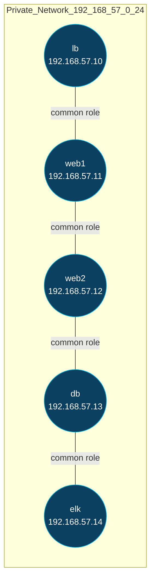

## فاز ۱ — Role: common (آماده‌سازی پایه سیستم‌ها روی Debian Bullseye)

### 1) معماری این فاز

معماری از نظر توپولوژی شبکه و نودها تغییر نکرده، ولی هر ۵ ماشین اکنون با نقش `common` پیکربندی پایه یکسان می‌گیرند:

```bash
elk-lab/
├── Vagrantfile
├── ansible/
│   ├── inventories/
│   │   └── vagrant/
│   │       └── hosts.ini
│   ├── playbooks/
│   │   └── common.yml
│   └── roles/
│       └── common/
│           └── tasks/
│               └── main.yml
└── ENV/  (virtualenv Python)
```


---

### 2) ساخت مسیرها و فایل‌های این فاز (ترمینال)

```bash
# ساخت ساختار role برای common
mkdir -p elk-lab/ansible/roles/common/{tasks,handlers,files,templates,vars,defaults}

# فایل‌های اصلی role common
: > elk-lab/ansible/roles/common/tasks/main.yml
: > elk-lab/ansible/roles/common/handlers/main.yml
: > elk-lab/ansible/roles/common/vars/main.yml
: > elk-lab/ansible/roles/common/defaults/main.yml

# ساخت playbook فاز ۱
mkdir -p elk-lab/ansible/playbooks
: > elk-lab/ansible/playbooks/common.yml
```

---

### 3) هدف و نقش این فاز

* **نصب بسته‌های پایه** : `curl`, `wget`, `vim`, `net-tools`, `htop`, `gnupg`, `apt-transport-https`
* **تنظیم locale و UTF-8** (en_US.UTF-8)
* **به‌روزرسانی سیستم** (`apt-get update && apt-get upgrade`)
* **تنظیم NTP/زمان سیستم** (مثلاً `chrony` یا `ntp`)
* **تنظیم hostname** بر اساس inventory
* **فعال‌سازی firewall (ufw)** با سیاست پایه (اجازه SSH)

---

### 4) تغییرات دقیق فایل‌ها

#### 4.1 فایل: `elk-lab/ansible/roles/common/defaults/main.yml`

* نوع تغییر: **ایجاد کامل (Full file)**
* نقش: مقادیر پیش‌فرض role

```yaml
# encoding: utf-8
---
common_locale: "en_US.UTF-8"
common_timezone: "UTC"
common_base_packages:
  - curl
  - wget
  - vim
  - net-tools
  - htop
  - gnupg
  - apt-transport-https
common_ntp_package: "chrony"
common_upgrade: false
common_set_locale: true
common_install_ntp: false
common_manage_firewall: false

```

---

#### 4.2 فایل: `elk-lab/ansible/roles/common/tasks/main.yml`

* نوع تغییر: **ایجاد کامل (Full file)**
* نقش: اعمال وظایف آماده‌سازی

```yaml
# encoding: utf-8
---
- name: Update apt cache
  apt:
    update_cache: yes
    cache_valid_time: 3600

- name: Upgrade all packages (optional)
  apt:
    upgrade: dist
    autoremove: yes
  when: false  # موقتاً غیر فعال برای دورزدن باگ Jinja/Ansible

- name: Ensure locales package is installed
  apt:
    name: locales
    state: present
  when: common_set_locale

- name: Generate UTF-8 locale
  command: locale-gen {{ common_locale }}
  when: common_set_locale

- name: Set system locale
  lineinfile:
    path: /etc/default/locale
    regexp: '^LANG='
    line: "LANG={{ common_locale }}"
  when: common_set_locale

- name: Install base packages
  apt:
    name: "{{ common_base_packages }}"
    state: present

- name: Set timezone
  timezone:
    name: "{{ common_timezone }}"

- name: Install NTP package (optional)
  apt:
    name: "{{ common_ntp_package }}"
    state: present
  when: common_install_ntp

- name: Ensure NTP service is enabled and running (optional)
  service:
    name: "{{ common_ntp_package }}"
    state: started
    enabled: yes
  when: common_install_ntp

- name: Install UFW (optional)
  apt:
    name: "{{ common_firewall_pkg }}"
    state: present
  when: common_manage_firewall

- name: Allow SSH in UFW (optional)
  ufw:
    rule: allow
    name: OpenSSH
  when: common_manage_firewall

- name: Enable UFW (optional)
  ufw:
    state: enabled
    policy: deny
  when: common_manage_firewall

- name: Ensure en_US.UTF-8 is enabled in /etc/locale.gen
  lineinfile:
    path: /etc/locale.gen
    regexp: '^#?en_US\.UTF-8 UTF-8'
    line: 'en_US.UTF-8 UTF-8'

- name: Regenerate locales (finalize)
  command: locale-gen
  changed_when: false

- name: Persist LC_ALL/LANG/LANGUAGE
  lineinfile:
    path: /etc/environment
    regexp: '^{{ item.key }}='
    line: '{{ item.key }}="{{ item.value }}"'
    create: yes
  loop:
    - { key: 'LANG',      value: '{{ common_locale }}' }
    - { key: 'LC_ALL',    value: '{{ common_locale }}' }
    - { key: 'LANGUAGE',  value: 'en_US:en' }

```
---

#### 4.3 فایل: `elk-lab/ansible/roles/common/handlers/main.yml`

* نوع تغییر: **ایجاد کامل (Full file)**

```yaml
# encoding: utf-8
---
# هندلرها در فازهای بعد برای سرویس‌های خاص اضافه می‌شوند
```

---

#### 4.4 فایل: `elk-lab/ansible/playbooks/common.yml`

* نوع تغییر: **ایجاد کامل (Full file)**
* نقش: اجرای role `common` روی همه ماشین‌ها

```yaml
# encoding: utf-8
---
- name: Apply common role to all nodes
  hosts: all
  become: yes
  roles:
    - role: common

```
### 4.5. ansible/inventories/vagrant/hosts.ini 


```ini
[loadbalancers]
lb ansible_host=192.168.57.10 ansible_ssh_private_key_file=.vagrant/machines/lb/virtualbox/private_key

[webservers]
web1 ansible_host=192.168.57.11 ansible_ssh_private_key_file=.vagrant/machines/web1/virtualbox/private_key
web2 ansible_host=192.168.57.12 ansible_ssh_private_key_file=.vagrant/machines/web2/virtualbox/private_key

[dbservers]
db ansible_host=192.168.57.13 ansible_ssh_private_key_file=.vagrant/machines/db/virtualbox/private_key

[elkservers]
elk ansible_host=192.168.57.14 ansible_ssh_private_key_file=.vagrant/machines/elk/virtualbox/private_key

[all:vars]
ansible_user=vagrant
host_key_checking=False

```

---

### 5) روش اجرای این فاز

```bash
cd elk-lab
ansible-playbook -i ansible/inventories/vagrant/hosts.ini ansible/playbooks/common.yml
```

---

### 6) تست و تأیید فاز ۱

1. بررسی نصب بسته‌ها:

```bash
vagrant ssh lb -c "curl --version && locale"
```

2. بررسی تنظیم timezone:

```bash
vagrant ssh db -c "timedatectl | grep 'Time zone'"
```

3. بررسی فعال بودن NTP:

```bash
vagrant ssh elk -c "systemctl status chrony"
```

4. بررسی UFW:

```bash
vagrant ssh web1 -c "sudo ufw status verbose"
```

---

### 7) ملاحظات نقش‌ها

* **DevOps** : زیرساخت یکسان و ایمن با UFW، NTP و Locale هماهنگ.
* **Backend/Software** : ابزارهای پایه برای تست سرویس‌ها نصب می‌شوند.
* **Database Manager** : ساعت دقیق برای لاگ‌های DB و replication.
* **Data Engineer** : Locale و timezone یکسان باعث می‌شود ترتیب رخدادها در ELK درست باشد.

---